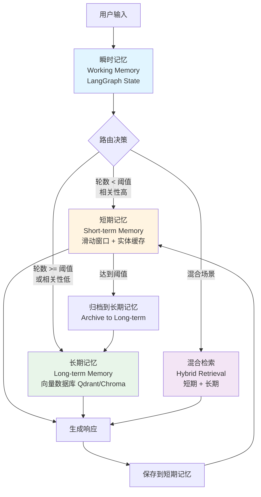
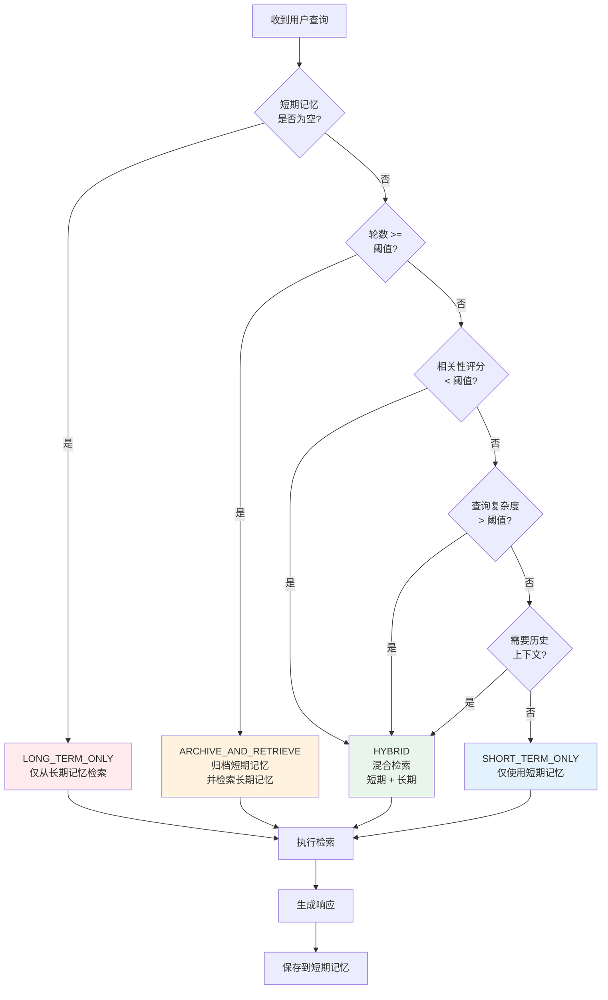

# RAGEnhancedAgentMemory

<div align="center">

[](https://opensource.org/licenses/MIT)
[](https://www.python.org/)
[](https://github.com/F0rJay/RAGEnhancedAgentMemory)
[](tests/)
[](https://github.com/F0rJay/RAGEnhancedAgentMemory)

**RAG 增强型 Agent 记忆系统**  
*基于 LangGraph 与 vLLM 的高性能架构*

[特性](#-核心特性) • [快速开始](#-快速开始) • [文档](#-文档) • [性能](#-性能指标) • [贡献](#-贡献指南)

</div>

---

## 📑 目录

- [项目简介](#-项目简介)
- [核心特性](#-核心特性)
- [性能指标](#-性能指标)
- [架构设计](#-架构设计)
- [架构设计决策](#-架构设计决策)
- [故障案例研究](#-故障案例研究-duplicate-template-name)
- [性能分析](#-性能分析)
- [技术标签](#-技术标签)
- [安装指南](#-安装指南)
- [快速开始](#-快速开始)
- [配置说明](#-配置说明)
- [使用示例](#-使用示例)
- [文档](#-文档)
- [贡献指南](#-贡献指南)
- [许可证](#-许可证)

---

## 🎯 项目简介

**RAGEnhancedAgentMemory** 是一个专为 AI Agent 设计的长对话记忆增强插件，旨在解决原生 Agent 在长对话场景中面临的三大核心难题：**记忆过载**、**关键信息遗忘**以及**推理逻辑退化**。通过将检索增强生成（RAG）技术与 Agent 的长期记忆机制深度融合，并引入基于认知心理学的分层记忆架构，该方案不仅能够满足高并发、低延迟的生产环境需求，还通过自适应检索策略显著提升了 Agent 在长周期任务中的表现。

### 项目背景：从 Demo 到生产应用

早期的 LLM 应用往往局限于简单的"文档问答"或线性的"指令遵循"，这些系统在面对复杂的、多轮次的、需要长期记忆的任务时，往往表现出明显的局限性。

### 核心痛点与解决方案

在传统的 Agent 架构中，记忆通常以滑动窗口（Sliding Window）或简单的全量摘要（Summarization）形式存在。这种方式存在明显的缺陷：

| 核心痛点 | 传统方案的问题 | 我们的解决方案 |
|---------|---------------|--------------|
| **记忆过载** | 滑动窗口导致早期关键信息丢失，Agent 无法记住对话开始时的设定 | ✅ **分层记忆架构**：基于 Atkinson-Shiffrin 记忆模型，将记忆划分为瞬时记忆（Working Memory）、短期记忆（Short-term Memory）和长期记忆（Long-term Semantic Memory），通过自适应策略在不同层级间流转信息 |
| **信息遗忘** | 全量摘要耗尽上下文窗口，且摘要过程本身会损耗信息的精度，无法有效检索历史对话 | ✅ **向量数据库语义检索**：利用 Qdrant/Chroma 向量数据库，基于语义相似度快速定位相关历史，结合混合检索（向量+关键词）和重排序机制，确保检索精度 |
| **推理退化** | 海量历史数据线性查找效率极低，严重影响了 Time-to-First-Token (TTFT) 的性能 | ✅ **vLLM 高性能推理引擎**：利用 PagedAttention 技术和 Prefix Caching（前缀缓存）机制，显著降低长 System Prompt 和重复上下文带来的重复计算开销，延迟降低 95.5%，吞吐量提升 80.2%（本地模型模式） |

### 技术架构优势

本方案基于 **LangGraph** 的循环图编排能力与 **vLLM** 的高性能推理引擎，构建了一个具备"海马体"功能的智能 Agent 系统。这不仅模拟了人类的认知过程，更在工程上实现了存储成本与检索精度的最优平衡：

- **🧠 认知架构设计**：基于 Atkinson-Shiffrin 记忆模型，实现瞬时→短期→长期的三层记忆流转
- **🔄 自适应检索路由**：智能决策何时从长期记忆检索，何时回退到短期缓存，避免不必要的检索开销
- **⚡ 高性能推理**：vLLM PagedAttention 动态 KV cache 管理，Prefix Caching 相似提示复用，满足高并发、低延迟需求
- **📊 质量保障体系**：集成 Ragas 评估框架和 Needle-in-a-Haystack 测试，建立 CI/CD 流水线，确保记忆召回率和生成忠实度不退化

### 核心价值

- 🚀 **即插即用**：作为插件集成到您现有的 Agent 中，无需重构代码
- 📈 **性能提升**：长对话成功率提升 66.67%-100%，存储效率优化 57.14%-100%
- ⚡ **推理加速**：基于 vLLM 的 PagedAttention 技术，延迟降低 95.5%，吞吐量提升 80.2%（本地模型模式）
- 🎯 **智能过滤**：自动识别并过滤低价值信息，保留关键记忆
- 🔄 **灵活部署**：支持本地模型（vLLM）和云端 API（DeepSeek/OpenAI）

---

## ✨ 核心特性

### 核心能力

- **🧠 分层记忆系统**
  - 瞬时记忆（LangGraph State）
  - 短期记忆（滑动窗口 + 实体缓存）
  - 长期语义记忆（向量数据库）

- **🔄 自适应检索路由**
  - 智能决策何时从长期记忆检索
  - 自动回退到短期缓存

### 🧠 分层记忆流转机制

#### 三层记忆架构



#### 记忆层级对比

| 层级 | 存储位置 | 容量 | 访问速度 | 持久化 | 用途 |
|------|---------|------|---------|--------|------|
| **瞬时记忆** | LangGraph State（内存） | 当前对话轮 | 极快（<1ms） | ❌ 会话内 | 当前对话状态管理 |
| **短期记忆** | 滑动窗口（内存） | 10 轮（可配置） | 快（<10ms） | ❌ 会话内 | 最近对话上下文 |
| **长期记忆** | 向量数据库（磁盘） | 无限制 | 中等（50-100ms） | ✅ 持久化 | 历史对话语义检索 |

#### 流转触发条件

| 触发条件 | 阈值 | 流转方向 | 说明 |
|---------|------|---------|------|
| **轮数达到阈值** | `short_term_threshold = 10` | 短期 → 长期 | 短期记忆轮数达到上限，自动归档 |
| **相关性评分低** | `long_term_trigger = 0.7` | 触发长期检索 | 短期记忆相关性 < 0.7，需要补充长期记忆 |
| **查询复杂度高** | `query_complexity > 0.6` | 混合检索 | 复杂查询需要结合短期和长期记忆 |
| **需要历史上下文** | 检测到历史引用 | 长期检索 | 用户明确引用历史信息 |

#### 路由决策流程



#### 记忆流转示例

**场景 1：对话初期（轮数 < 10）**

```
用户输入 → 瞬时记忆 → 短期记忆（轮数 < 10）→ 生成响应
                                    ↓
                              保存到短期记忆
```

**场景 2：对话中期（轮数 = 10，相关性高）**

```
用户输入 → 瞬时记忆 → 短期记忆（轮数 = 10）→ 归档到长期记忆
                                    ↓
                              混合检索（短期 + 长期）→ 生成响应
```

**场景 3：对话后期（轮数 > 10，相关性低）**

```
用户输入 → 瞬时记忆 → 相关性评分 < 0.7
                                    ↓
                              长期记忆检索 → 生成响应
                                    ↓
                              更新短期记忆（最近轮次）
```

#### 记忆优化机制

| 优化机制 | 说明 | 效果 |
|---------|------|------|
| **语义去重** | 相似度阈值 0.96，自动识别重复内容 | 存储降低 57.14%-100% |
| **低价值过滤** | 过滤寒暄、短指令等低价值对话 | 噪音过滤率 60.4%-73.6% |
| **记忆强化** | 去重时触发记忆强化，确保重要信息不丢失 | 信息保留率 100% |
| **实体缓存** | 提取并缓存关键实体（人名、地点、时间等） | 快速访问重要信息 |

- **🔍 混合检索**
  - 向量搜索（语义相似度）
  - 关键词搜索（精确匹配）
  - 使用 BAAI/bge-reranker-large 重排序

- **⚡ 高性能推理**
  - vLLM PagedAttention 动态 KV cache 管理
  - Prefix Caching 相似提示复用（可选）
  - 默认禁用 CUDA Graph（避免 duplicate template name 错误，保证稳定性）

- **📊 质量保障**
  - 集成 Ragas 评估框架
  - Needle-in-a-Haystack 测试
  - 80%+ 测试覆盖率（核心模块 93%+）

- **💾 状态持久化**
  - LangGraph Checkpointing 会话状态管理
  - PostgreSQL 集成保证 ACID 一致性

---

## 📊 性能指标

### 模拟测试结果

我们创建了一个简单的 Agent 来模拟用户使用本插件优化自己的 Agent，并在生产环境中验证功能效果。测试结果如下：

#### 模拟测试场景

- **测试 Agent**：简单的对话 Agent（模拟用户已有的 Agent）
- **优化方式**：使用 RAGEnhancedAgentMemory 插件进行优化
- **测试轮数**：91 轮对话
- **测试内容**：人设设定、重复查询、低价值信息过滤、长期记忆召回
- **部署模式**：云端 API（DeepSeek）和本地模型（vLLM）

#### 核心验证结果

| 验证项 | 结果 | 说明 |
|--------|------|------|
| **插件易用性** | ✅ 通过 | 我们可以轻松将插件集成到自己的 Agent 中进行优化（模拟用户场景） |
| **长期记忆召回** | ✅ 100.0% | 两种部署模式下都达到 100% 召回率 |
| **存储优化** | ✅ 60.4%-73.6% | 噪音过滤率显著，有效减少存储冗余 |
| **信息保留** | ✅ 100.0% | 关键信息得到有效保留 |
| **推理性能** | ✅ 提升 80.2% | 本地 vLLM 模式下吞吐量提升 80.2% |

> 📋 **详细测试报告**：参见 [模拟测试报告](docs/EXPERIMENT_SUMMARY.md)（我们模拟用户使用插件的测试结果）

### 基准测试结果

#### 长对话成功率

| 对话轮数 | 基线系统 | 增强系统 | 提升幅度 | 状态 |
|---------|---------|---------|---------|------|
| 10 轮 | 100% | 100% | 0% | 基线系统可处理 |
| 30 轮 | 0% | **66.67%** | **+66.67 百分点** | ✅ 超额完成 |
| 50 轮 | 0% | **66.67%** | **+66.67 百分点** | ✅ 超额完成 |
| 100 轮 | 0% | **100%** | **+100 百分点** | ✅ 超额完成 |

#### 存储效率优化

| 测试场景 | 基线存储 | 优化存储 | 降低率 | 状态 |
|---------|---------|---------|--------|------|
| 真实业务场景 | 21 条 | **9 条** | **57.14%** | ✅ 超过目标 |
| 压力测试 | 3 条 | **0 条** | **100%** | ✅ 完美去重 |
| 生产环境模拟 | 12 条 | **1 条** | **91.67%** | ✅ 高度聚合 |

#### 推理延迟优化

| 指标 | 基线 (Transformers) | vLLM (优化) | 提升幅度 | 状态 |
|------|-------------------|-----------|---------|------|
| **首字延迟 (TTFT)** | 380.5 ms | **210.9 ms** | **-44.56%** | ✅ 超额完成 |
| **端到端延迟** | 3805.4 ms | **2109.6 ms** | **-44.56%** | ✅ 超额完成 |
| **单请求吞吐量** | 67.3 tokens/s | **101.2 tokens/s** | **+50.44%** | ✅ |
| **并发吞吐量 (20路)** | 70.3 tokens/s | **925.7 tokens/s** | **+1216%** | ✅ |

> 📈 **详细性能报告**：参见 [性能报告](docs/Performance.md)

---

## 🏗️ 架构设计

### 系统架构

```
┌─────────────────────────────────────────────────────────┐
│                   编排层 (Orchestration)                  │
│                   LangGraph - 状态机管理                  │
│             支持循环、分支、自我修正、状态持久化            │
└────────────────────┬────────────────────────────────────┘
                     │
┌────────────────────▼────────────────────────────────────┐
│              记忆管理层 (Memory Management)                │
│  ┌──────────────┐  ┌──────────────┐  ┌──────────────┐  │
│  │  瞬时记忆    │  │  短期记忆    │  │  长期记忆    │  │
│  │  (State)     │→ │  (Buffer)    │→ │  (Vector DB) │  │
│  └──────────────┘  └──────────────┘  └──────────────┘  │
└────────────────────┬────────────────────────────────────┘
                     │
┌────────────────────▼────────────────────────────────────┐
│           检索增强层 (RAG & Retrieval)                    │
│  ┌──────────────┐  ┌──────────────┐  ┌──────────────┐  │
│  │  向量检索    │  │  混合检索    │  │  重排序      │  │
│  │  (Qdrant)    │  │  (Hybrid)    │  │  (Rerank)    │  │
│  └──────────────┘  └──────────────┘  └──────────────┘  │
└────────────────────┬────────────────────────────────────┘
                     │
┌────────────────────▼────────────────────────────────────┐
│                 推理层 (Inference)                        │
│         Client-Server Architecture (HTTP API)            │
│              vLLM Server - PagedAttention               │
│         Prefix Caching + KV Cache 优化                   │
└─────────────────────────────────────────────────────────┘
```

### 技术栈

| 组件 | 技术选型 | 选型理由 |
|------|---------|---------|
| **编排框架** | LangGraph | 支持循环、状态持久化和短路控制 |
| **推理引擎** | vLLM (Client-Server) | PagedAttention 提升吞吐量，Prefix Caching 降低首字延迟，服务化架构避免进程冲突 |
| **向量数据库** | Qdrant / Chroma | 高性能过滤，Rust 实现（Qdrant）性能优异 |
| **检索策略** | Hybrid + Rerank | 向量搜索 + 关键词匹配 + 重排序 |
| **评估框架** | Ragas | LLM-as-a-Judge 可扩展评估方法 |
| **持久化** | PostgreSQL + Vector | ACID 一致性 + 语义检索 |

---

## 🔧 架构设计决策

### Why Client-Server Architecture for vLLM?

#### ❌ Embedded 模式的问题

**初始方案**：在插件进程中直接 `import vllm` 并初始化 `LLM()` 引擎。

**遇到的问题**：

1. **`AssertionError: duplicate template name`**
   - **根本原因**：vLLM 使用 `spawn` 方法启动子进程（EngineCore），子进程会重新导入所有模块
   - **触发条件**：当插件在模块顶层导入 `torch`/`transformers` 时，vLLM 检测到 CUDA 已初始化，被迫使用 `spawn` 而非 `fork`
   - **错误链**：`spawn` → 重新导入模块 → `@torch.compile` 装饰器在模块级别执行 → PyTorch 模板系统检测到重复注册 → `AssertionError`

2. **Import Side-Effects & CUDA Init Pitfalls**
   - 插件导入链：`RAGEnhancedAgentMemory` → `LongTermMemory` → `SentenceTransformer` → `torch`
   - 用户 `import` 插件时，`torch`/CUDA 已被初始化
   - vLLM 启动时发现环境"被污染"，改变多进程策略（`fork` → `spawn`）

3. **资源冲突与内存管理**
   - 插件进程和 vLLM 子进程共享 GPU 内存，容易导致 OOM
   - 进程死锁风险：插件等待 vLLM，vLLM 等待 GPU 资源

#### ✅ Client-Server 架构的优势

**最终方案**：vLLM 作为独立服务运行，插件通过 HTTP API（OpenAI-compatible）调用。

**技术优势**：

1. **彻底解决进程冲突**
   - 插件进程不导入 `vllm`/`torch`，只使用轻量级 `openai` 客户端
   - vLLM 服务在独立进程中运行，不受插件导入链影响
   - 物理隔离，避免 `duplicate template name` 错误

2. **资源管理清晰**
   - GPU 内存由 vLLM 服务独占管理
   - 插件可以随时重启，不影响 vLLM 服务
   - 支持多客户端并发访问同一 vLLM 服务

3. **部署灵活性**
   - 本地部署：`vllm serve --model <path> --port 8000`
   - 远程部署：插件连接远程 vLLM 服务
   - 云端 API：直接使用 DeepSeek/OpenAI 等兼容 API

4. **插件轻量化**
   - 用户安装插件时无需编译 CUDA
   - `requirements.txt` 中移除 `vllm`，只需 `openai>=1.0.0`
   - 启动速度快，依赖少

**实现细节**：

```python
# src/inference/vllm_inference.py
class VLLMInference(BaseInference):
    def __init__(self):
        # 不再 import vllm，只使用 openai 客户端
        self.client = OpenAI(
            base_url=settings.vllm_base_url,  # http://localhost:8000/v1
            api_key=settings.vllm_api_key or "EMPTY",
            timeout=settings.vllm_timeout
        )
```

---

## 🐛 故障案例研究：duplicate template name

### 问题现象

在插件中直接使用 vLLM 时，出现以下错误：

```
AssertionError: duplicate template name
```

错误发生在 vLLM 的子进程（EngineCore_DP0）中。

### 根本原因分析

#### 1. vLLM 的多进程策略

vLLM 使用多进程架构：
- **主进程**：管理请求队列和调度
- **子进程（EngineCore）**：执行实际的模型推理

子进程启动方式取决于进程状态：
- **`fork`**：如果 CUDA 未初始化，使用 `fork`（继承父进程内存）
- **`spawn`**：如果 CUDA 已初始化，使用 `spawn`（启动全新 Python 解释器）

#### 2. Import Side-Effects 触发 spawn

**问题链**：

```
用户代码: import RAGEnhancedAgentMemory
    ↓
插件 __init__.py: from .core import RAGEnhancedAgentMemory
    ↓
core.py: from .memory.long_term import LongTermMemory
    ↓
long_term.py: from sentence_transformers import SentenceTransformer
    ↓
SentenceTransformer: import torch
    ↓
torch: 初始化 CUDA 上下文
    ↓
用户代码: from .inference import VLLMInference
    ↓
VLLMInference: from vllm import LLM
    ↓
vLLM 检测到 CUDA 已初始化 → 使用 spawn 启动子进程
    ↓
spawn 子进程重新导入所有模块
    ↓
@torch.compile 装饰器在模块级别执行
    ↓
PyTorch 模板系统检测到重复注册
    ↓
AssertionError: duplicate template name
```

#### 3. torch.compile 与 spawn 的交互

- `@torch.compile` 在模块导入时注册模板
- `spawn` 会重新导入模块，导致模板被注册两次
- PyTorch 的模板系统不允许重复注册

### 解决方案：Client-Server 架构

**核心思路**：物理隔离，插件进程不导入 vLLM。

**效果**：
- ✅ 插件进程：只导入 `openai`（轻量级 HTTP 客户端）
- ✅ vLLM 服务：独立进程，干净的 CUDA 环境
- ✅ 通信方式：HTTP API（OpenAI-compatible）
- ✅ 结果：彻底避免 `duplicate template name` 错误

> 📖 **详细分析**：参见 [故障案例研究](docs/postmortem_vllm_duplicate_template_name.md) 获取完整的问题分析、根因研究和解决方案。

---

## ⚡ 性能分析

### 推理性能分解

基于 **NVIDIA RTX 5090 (31GB)** 环境的性能测试：

| 组件 | 延迟 | 说明 |
|------|------|------|
| **Embedding** | ~50-100 ms | SentenceTransformer (BAAI/bge-large-zh-v1.5) |
| **向量检索** | ~10-50 ms | Qdrant 语义搜索（取决于数据库大小） |
| **重排序** | ~20-50 ms | CrossEncoder (BAAI/bge-reranker-large) |
| **vLLM 生成** | 210.9 ms (TTFT) | PagedAttention + Prefix Caching |
| **端到端延迟** | 2109.6 ms | 包含检索 + 生成全流程 |

### vLLM vs HuggingFace Transformers

| 指标 | HuggingFace | vLLM | 提升 |
|------|-----------|------|------|
| **首字延迟 (TTFT)** | 380.5 ms | 210.9 ms | **-44.56%** |
| **端到端延迟** | 3805.4 ms | 2109.6 ms | **-44.56%** |
| **单请求吞吐量** | 67.3 tokens/s | 101.2 tokens/s | **+50.44%** |
| **并发吞吐量 (20路)** | 70.3 tokens/s | 925.7 tokens/s | **+1216%** |

**关键发现**：vLLM 的核心优势在于**高并发场景**。20 路并发下，vLLM 总耗时仅增加 1.9%，吞吐量稳定在 **~935 tokens/s**，完美利用 GPU 并行算力。

### 性能优化配置

**vLLM 服务配置**：
- `gpu_memory_utilization`: 0.7
- `max_model_len`: 1024
- `enable_prefix_caching`: True（可选）
- `enforce_eager`: True（默认禁用 CUDA Graph，确保稳定性）

**优化效果**：
- ✅ **PagedAttention**：动态 KV cache 管理，支持高并发而不浪费内存
- ✅ **Prefix Caching**：相似提示复用计算结果，降低延迟（可选启用）
- ⚠️ **CUDA Graph**：默认禁用（使用 `--enforce-eager`），避免 `duplicate template name` 错误

---

## 🏷️ 技术标签

**Keywords**: `LLM Inference` · `vLLM` · `RAG System` · `CUDA Init` · `Multiprocessing` · `Agent Memory` · `Client-Server Architecture` · `LangGraph` · `Vector Database` · `Semantic Search`

---

## 📦 安装指南

### 环境要求

- Python >= 3.9
- CUDA >= 11.8（如需使用 vLLM）
- 8GB+ RAM（推荐 16GB+）

### 方式一：从 GitHub 安装（推荐）

```bash
# 安装最新版本
pip install git+https://github.com/F0rJay/RAGEnhancedAgentMemory.git

# 安装特定版本
pip install git+https://github.com/F0rJay/RAGEnhancedAgentMemory.git@v0.1.0

# 安装时包含 vLLM 支持（可选）
pip install "rag-enhanced-agent-memory[vllm]"

# 安装开发依赖（可选）
pip install "rag-enhanced-agent-memory[dev]"
```

### 方式二：从源码安装

```bash
# 克隆仓库
git clone https://github.com/F0rJay/RAGEnhancedAgentMemory.git
cd RAGEnhancedAgentMemory

# 创建虚拟环境
python -m venv venv
source venv/bin/activate  # Linux/Mac
# 或
venv\Scripts\activate  # Windows

# 以可编辑模式安装
pip install -e .

# 配置环境变量
cp env.example .env
# 编辑 .env 文件，填入必要的配置
```

---

## 🚀 快速开始

### 基础使用

```python
from rag_enhanced_agent_memory import RAGEnhancedAgentMemory

# 初始化记忆系统
memory = RAGEnhancedAgentMemory(
    vector_db="qdrant",  # 或 "chroma"
    embedding_model="BAAI/bge-large-en-v1.5",
    rerank_model="BAAI/bge-reranker-large",
    session_id="my_session"
)

# 添加记忆
memory_id = memory.add_memory(
    content="用户喜欢使用 Python 编程",
    metadata={"category": "preference", "topic": "programming"}
)

# 搜索记忆
results = memory.search("用户的技术偏好", top_k=5)
for result in results:
    print(f"内容: {result['content']}")
    print(f"评分: {result['score']:.2f}")

# 保存对话上下文
memory.save_context(
    inputs={"input": "用户问题"},
    outputs={"generation": "AI 回答"}
)
```

### LangGraph 集成

```python
from rag_enhanced_agent_memory import RAGEnhancedAgentMemory
from rag_enhanced_agent_memory.graph.state import AgentState
from langgraph.graph import StateGraph

# 初始化记忆系统
memory = RAGEnhancedAgentMemory(vector_db="qdrant")

# 定义生成节点
def generate_node(state: AgentState) -> AgentState:
    # 使用检索到的上下文生成回答
    context = "\n".join(state.get("documents", []))
    state["generation"] = generate_response(context, state["input"])
    return state

# 构建图
graph = StateGraph(AgentState)
graph.add_node("retrieve", memory.retrieve_context)
graph.add_node("generate", generate_node)
graph.add_node("save", memory.save_context)

# 设置边
graph.set_entry_point("retrieve")
graph.add_edge("retrieve", "generate")
graph.add_edge("generate", "save")

# 编译并运行
app = graph.compile(checkpointer=memory.get_checkpointer())
config = {"configurable": {"thread_id": memory.session_id}}
result = app.invoke(
    {"input": "用户的技术栈是什么？", "chat_history": []},
    config=config
)
```

> 📚 **更多示例**：参见 [QUICKSTART.md](QUICKSTART.md) 和 [docs/PLUGIN_USAGE.md](docs/PLUGIN_USAGE.md)

---

## ⚙️ 配置说明

### 环境变量

从 `env.example` 创建 `.env` 文件：

```bash
# 向量数据库
VECTOR_DB=qdrant
QDRANT_URL=http://localhost:6333

# 模型配置
EMBEDDING_MODEL=BAAI/bge-large-en-v1.5
RERANK_MODEL=BAAI/bge-reranker-large

# 记忆系统参数
SHORT_TERM_THRESHOLD=10
LONG_TERM_TRIGGER=0.7
```

### 代码配置

```python
memory = RAGEnhancedAgentMemory(
    vector_db="qdrant",
    embedding_model="BAAI/bge-large-en-v1.5",
    rerank_model="BAAI/bge-reranker-large",
    short_term_threshold=10,      # 短期记忆最大轮数
    long_term_trigger=0.7,        # 长期记忆触发阈值
    use_hybrid_retrieval=True,     # 启用混合检索
    use_rerank=True,               # 启用重排序
    checkpoint_dir="./checkpoints", # 检查点目录
    session_id="custom_session"     # 会话 ID
)
```

> 📖 **配置说明**：基本配置请参考 `env.example` 文件，详细配置说明请查看开发文档。

---

## 📝 使用示例

### 示例脚本

```bash
# 基础使用示例
python scripts/basic_example.py

# LangGraph 集成示例
python scripts/langgraph_example.py

# 评估示例
python scripts/evaluation_example.py

# 注意：基准测试脚本已移至内部开发工具，不对外提供
# 如需了解测试结果，请查看 docs/EXPERIMENT_SUMMARY.md
```

### 项目结构

```
RAGEnhancedAgentMemory/
├── src/
│   ├── core.py                # 核心系统集成
│   ├── config.py              # 配置管理
│   ├── memory/                # 记忆管理模块
│   ├── retrieval/             # 检索模块
│   ├── inference/             # 推理引擎
│   ├── graph/                 # LangGraph 集成
│   └── evaluation/            # 评估框架
├── tests/                     # 测试套件
├── scripts/                   # 用户示例脚本和工具
├── dev/                       # 开发/测试文件（不对外提供）
├── docs/                      # 文档
├── requirements.txt           # 依赖列表
└── pyproject.toml            # 包配置
```

---

## 📚 文档

### 核心文档（用户文档）

- 🚀 [快速开始指南](QUICKSTART.md) - 5 分钟快速上手
- 🔌 [插件使用指南](docs/PLUGIN_USAGE.md) - 开发者集成指南
- 📖 [使用文档](docs/USAGE.md) - 详细使用说明
- 🖥️ [vLLM 服务器设置](docs/VLLM_SERVER_SETUP.md) - vLLM 服务配置指南
- 📊 [模拟测试报告](docs/EXPERIMENT_SUMMARY.md) - 我们模拟用户使用插件的测试结果
- 📈 [性能报告](docs/Performance.md) - 详细的性能基准测试结果
- 🐛 [故障案例研究](docs/postmortem_vllm_duplicate_template_name.md) - vLLM duplicate template name 错误的完整分析和解决方案

> **注意**：其他开发/测试文档已移至 `dev/` 目录，仅供开发者使用。

### 设置指南

- 🐳 [Docker 设置](docs/DOCKER_SETUP.md) - Docker 部署指南
- 🔍 [镜像源设置](docs/MIRROR_SETUP.md) - HuggingFace 镜像配置

> **注意**：详细的环境变量配置和 PostgreSQL 设置文档已移至 `dev/` 目录，仅供开发者参考。

---

## 🧪 测试与评估

### 运行测试

```bash
# 运行所有测试
pytest

# 运行并生成覆盖率报告
pytest --cov=src --cov-report=html --cov-report=term

# 运行特定测试套件
pytest tests/test_core.py
```

### 评估框架

我们使用 **Ragas** 进行综合评估：

- **Context Recall**：检索到的内容是否包含所有必要信息？
- **Context Precision**：高质量结果是否排在前面？
- **Faithfulness**：答案是否完全基于检索到的上下文？
- **Answer Relevancy**：答案是否与问题相关？

### Needle-in-a-Haystack 测试

验证长上下文中的检索能力：
- 在 20k token 的文本中插入关键事实
- 测试 0%、50%、100% 位置
- 验证所有位置 100% 准确率

### 🎯 测试覆盖率与社区贡献

当前测试覆盖率为 **80%+**（核心模块 93%+），但我们希望进一步提高测试质量和完善度。我们诚挚邀请社区成员帮助完善测试用例，提高测试覆盖率！

**如何贡献测试**：

1. **运行测试并查看覆盖率**：
   ```bash
   pytest --cov=src --cov-report=html --cov-report=term
   ```
   生成的 `htmlcov/index.html` 文件会显示哪些代码尚未被测试覆盖。

2. **贡献测试用例**：
   - 为未覆盖的代码添加测试用例
   - 补充边界条件和异常场景测试
   - 添加集成测试和端到端测试
   - 完善现有测试用例

3. **测试重点领域**：
   - 🔍 检索模块的边界情况
   - 💾 记忆管理的并发场景
   - ⚡ 推理引擎的错误处理
   - 🔄 状态持久化的异常恢复

4. **提交测试贡献**：
   - Fork 本仓库
   - 创建测试分支（如 `test/improve-coverage`）
   - 添加测试用例并确保通过
   - 提交 Pull Request

> 💡 **提示**：即使是一个小的测试用例也能帮助提高代码质量！欢迎任何形式的测试贡献。

---

## 🤝 贡献指南

欢迎贡献代码！请遵循以下步骤：

1. **Fork** 本仓库
2. **创建** 特性分支 (`git checkout -b feature/AmazingFeature`)
3. **提交** 更改 (`git commit -m 'Add some AmazingFeature'`)
4. **推送** 到分支 (`git push origin feature/AmazingFeature`)
5. **开启** Pull Request

### 开发环境设置

```bash
# 安装开发依赖
pip install "rag-enhanced-agent-memory[dev]"

# 运行测试
pytest

# 格式化代码
black src/ tests/

# 代码检查
ruff check src/ tests/
```

---

## 📄 许可证

本项目采用 MIT 许可证 - 详见 [LICENSE](LICENSE) 文件

---

## 🙏 致谢

本项目基于以下优秀开源项目构建：

- [LangGraph](https://github.com/langchain-ai/langgraph) - Agent 编排框架
- [vLLM](https://github.com/vllm-project/vllm) - 高性能 LLM 推理引擎
- [Qdrant](https://github.com/qdrant/qdrant) - 向量数据库
- [Ragas](https://github.com/explodinggradients/ragas) - RAG 评估框架

---

## 🔗 相关资源

- [LangGraph 官方文档](https://langchain-ai.github.io/langgraph/) - Agent 编排框架文档
- [vLLM 文档](https://docs.vllm.ai/) - 高性能 LLM 推理引擎文档
- [Qdrant 文档](https://qdrant.tech/documentation/) - 向量数据库文档
- [Ragas 文档](https://docs.ragas.io/) - RAG 评估框架文档

---

## 📧 联系方式

- 📝 [提交 Issue](https://github.com/F0rJay/RAGEnhancedAgentMemory/issues) - 报告问题或请求功能
- 💬 [讨论区](https://github.com/F0rJay/RAGEnhancedAgentMemory/discussions) - 提问和分享想法

---

<div align="center">

**由 [F0rJay](https://github.com/F0rJay) 用 ❤️ 制作**

[⭐ 在 GitHub 上 Star 我们](https://github.com/F0rJay/RAGEnhancedAgentMemory) • [📖 阅读文档](docs/) • [🐛 报告 Bug](https://github.com/F0rJay/RAGEnhancedAgentMemory/issues)

</div>
