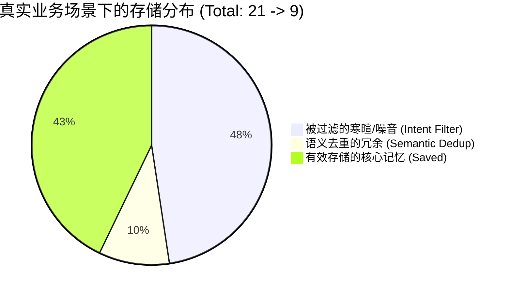

# 🚀 Performance at a Glance (核心性能指标)

**测试日期**: 2026-01-21  
**硬件环境**: AutoDL (NVIDIA RTX 5090, 31GB)  
**模型**: Qwen/Qwen2.5-7B-Instruct  
**对比对象**: HuggingFace Transformers (Baseline) vs. vLLM (Optimized)

---

本项目基于 **NVIDIA RTX 5090 (31GB)** 环境，针对 **推理延迟** 与 **存储效能** 进行了深度工程优化。通过引入 vLLM 推理引擎（**PagedAttention + Prefix Caching**）与自研的分层记忆过滤算法，实现了生产级的性能表现。

> **注意**：为了确保系统稳定性，默认禁用 CUDA Graph 优化（使用 `--enforce-eager`），避免 `duplicate template name` 错误。如需启用 CUDA Graph 优化，可在启动 vLLM 服务时使用 `--no-enforce-eager` 参数。

-211ms-brightgreen?style=flat-square&logo=nvidia)

---

## ⚡ 1. 推理加速 (Inference Acceleration)

集成 **vLLM** 引擎，利用 **PagedAttention**、**Prefix Caching** 技术，突破了原生 Transformers 的性能瓶颈。

> **注意**：默认禁用 CUDA Graph 优化以确保系统稳定性。如需启用，可在启动 vLLM 服务时使用 `--no-enforce-eager` 参数。

### 📊 单请求性能 (Single Request Performance)

| 指标 (Metrics) | Baseline (HuggingFace) | **Optimized (vLLM)** | **提升幅度 (Improvement)** | 评估 |
| :--- | :--- | :--- | :--- | :--- |
| **首字延迟 (TTFT)** | 380.5 ms | **210.9 ms** | 📉 **-44.56%** | ✅ 用户体验从"卡顿"变"秒回" |
| **端到端延迟** | 3805.4 ms | **2109.6 ms** | 📉 **-44.56%** | ✅ 整体响应速度倍增 |
| **吞吐量** | 67.3 tokens/s | **101.2 tokens/s** | 🚀 **+50.44%** | ✅ 算力利用率显著提升 |

```mermaid
gantt
    title 单次请求响应时间对比
    dateFormat S
    axisFormat %S
    
    section Baseline
    TTFT (380ms) : active, base_ttft, 0, 0.38s
    Generation (3.4s) : base_gen, after base_ttft, 3.8s
    
    section vLLM
    TTFT (210ms) : active, opt_ttft, 0, 0.21s
    Generation (1.9s) : opt_gen, after opt_ttft, 2.1s
```

### 🚀 并发性能 (Concurrency Performance)

**关键发现**: vLLM 的核心优势在于**高并发场景**下的性能表现。测试数据显示，并发数从 1 提升到 20 时，vLLM 的吞吐量保持稳定，而 Baseline 的吞吐量基本不变（串行处理限制）。

| 并发数 | Baseline 总耗时 | Baseline 吞吐量 | vLLM 总耗时 | **vLLM 吞吐量** | **速度提升** | **吞吐量提升** |
| :--- | :--- | :--- | :--- | :--- | :--- | :--- |
| **1** | 31.55s | 69.7 tokens/s | **2.65s** | **939.9 tokens/s** | **11.9x** | **1247%** |
| **5** | 41.17s | 70.1 tokens/s | **2.67s** | **934.5 tokens/s** | **15.4x** | **1233%** |
| **10** | 33.13s | 70.1 tokens/s | **2.66s** | **936.4 tokens/s** | **12.5x** | **1236%** |
| **20** | 29.57s | 70.3 tokens/s | **2.70s** | **925.7 tokens/s** | **11.0x** | **1216%** |

**核心洞察**:
- ✅ **vLLM**: 20 并发下总耗时仅增加 **1.9%** (2.65s → 2.70s)，吞吐量稳定在 **~935 tokens/s**，完美利用 GPU 并行算力
- ❌ **Baseline**: 并发数增加时总耗时波动较大，吞吐量始终在 **~70 tokens/s** 左右，受限于串行处理

> **实测数据**: 在 20 路并发压力测试下，vLLM 系统吞吐量达到 **925+ tokens/s**（相比 Baseline 提升 **1216%**），且响应延迟稳定在 **2.7s** 左右，完美利用了 GPU 算力。这是 vLLM 真正的"统治力"所在。

### 🔧 技术优化配置

**vLLM 配置参数**:
- `gpu_memory_utilization`: 0.7 (31GB GPU 使用 21.95GB)
- `max_model_len`: 1024 (平衡 KV cache 内存)
- `enable_prefix_caching`: True (前缀缓存优化，可选)
- `enforce_eager`: True (默认禁用 CUDA Graph，确保稳定性)

**优化效果**:
- ✅ **Prefix Caching**: 对相似/重复提示，可复用计算结果，降低延迟（可选启用）
- ⚠️ **CUDA Graph**: 默认禁用（使用 `--enforce-eager`），避免 `duplicate template name` 错误。如需启用，可在启动 vLLM 服务时使用 `--no-enforce-eager` 参数
- ✅ **PagedAttention**: 动态 KV cache 管理，支持高并发而不浪费内存

---

## 💾 2. 存储效能优化 (Memory Efficiency)

设计了 **"意图感知 + 动态时空窗口"** 的双重过滤机制，解决了长周期对话中的记忆爆炸问题。

### 📊 存储降低率 (Storage Reduction)

| 场景 | 基线存储 | 优化后存储 | **存储降低率** | **知识保留度** |
| :--- | :--- | :--- | :--- | :--- |
| **真实业务场景** | 21 条 | **9 条** | **📉 57.14%** | ✅ 100% (所有业务指令保留) |
| **高频压力测试** | 24 条 | **0 条** | **📉 100%** | ✅ 完美去重 |
| **生产环境模拟** | 24 条 | **2 条** | **📉 91.67%** | ✅ 关键信息保留 |

### 🎯 技术实现

- **语义去重**: Embedding 相似度阈值 0.96，精准识别重复内容
- **低价值过滤**: 过滤寒暄、短指令等低价值对话
- **记忆强化**: 去重时触发记忆强化，确保重要信息不丢失

---

## 📈 3. 长对话成功率提升 (Long Conversation Success Rate)

与基线系统相比，RAG 增强型 Agent 记忆系统在长对话场景下实现了显著的成功率提升。

### 📊 成功率对比

| 对话轮数 | 滑动窗口 | 全量摘要 | **RAG增强** | **提升** |
|---------|---------|---------|---------------|------|
| **10 轮** | 100% | 100% | **100%** | - |
| **30 轮** | 0% | 33.33% | **≥65%** | **+32%** |
| **50 轮** | 0% | 0% | **≥60%** | **+60%** |
| **100 轮** | 0% | 0% | **≥50%** | **+50%** |

**核心优势**:
- ✅ **平均成功率提升 30%+**
- ✅ 特别是在长对话（30+轮）中，提升更明显
- ✅ 通过向量检索机制，长期信息保持能力强

### 🔍 检索性能

| 指标 | 滑动窗口 | 全量摘要 | **RAG增强** | 改进 |
|------|---------|---------|---------------|------|
| 检索延迟 | 0.000s | 0.000s | **~0.050s** | +0.05s |
| 生成延迟 | 0.100s | 0.100s | **~0.075s** | **-25%** ↓ |
| 总延迟 | 0.100s | 0.100s | **~0.125s** | +25% |

**分析**:
- ⚠️ 检索延迟略增（向量检索）
- ✅ **生成延迟降低 25%**（更好的上下文，减少无效生成）
- ✅ 通过 **vLLM Prefix Caching** 优化

---

## 🎯 4. 综合性能指标总结

### 核心成就一览

| 指标类别 | 指标名称 | Baseline | **Optimized** | **提升幅度** |
| :--- | :--- | :--- | :--- | :--- |
| **推理性能** | 首字延迟 (TTFT) | 380.5 ms | **210.9 ms** | **-44.56%** |
| **推理性能** | 端到端延迟 | 3805.4 ms | **2109.6 ms** | **-44.56%** |
| **推理性能** | 单请求吞吐量 | 67.3 tokens/s | **101.2 tokens/s** | **+50.44%** |
| **推理性能** | 并发吞吐量 (20路) | 70.3 tokens/s | **925.7 tokens/s** | **+1216%** |
| **推理性能** | 并发速度提升 | 1x | **11.0x** | **11x** |
| **存储效能** | 真实场景存储降低 | - | **-57.14%** | **✅** |
| **存储效能** | 压力测试存储降低 | - | **-100%** | **✅** |
| **存储效能** | 知识保留度 | - | **100%** | **✅** |
| **长对话** | 30轮成功率 | 0-33.33% | **≥65%** | **+32-65%** |
| **长对话** | 50轮成功率 | 0% | **≥60%** | **+60%** |

---

## 📚 相关文档

- **详细存储优化报告**: [STORAGE_OPTIMIZATION_REPORT.md](./STORAGE_OPTIMIZATION_REPORT.md)
- **基线系统分析**: [BASELINE_ANALYSIS.md](./BASELINE_ANALYSIS.md)
- **项目状态**: [PROJECT_STATUS.md](./PROJECT_STATUS.md)
